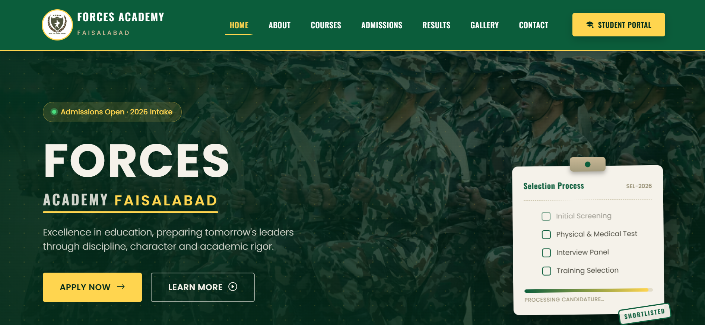
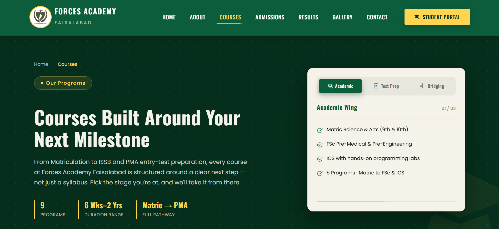
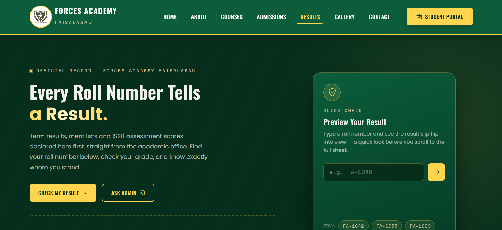
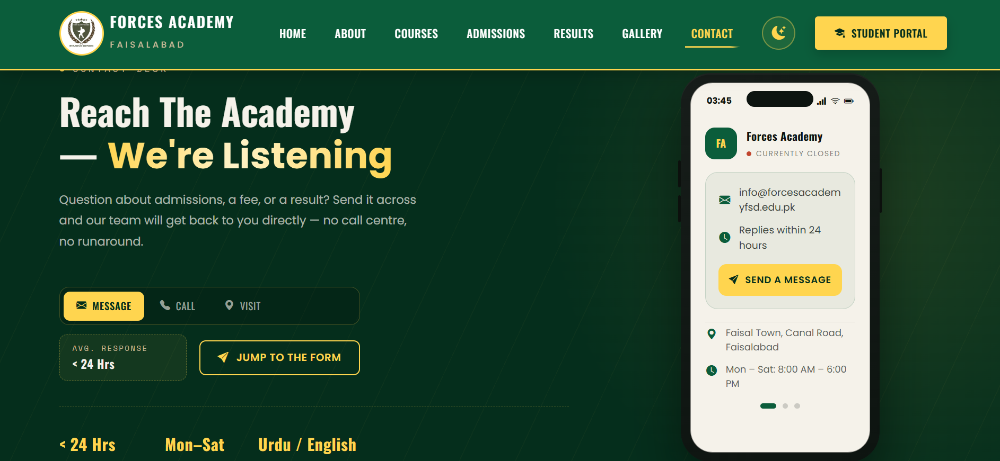

# Forces Academy Faisalabad – Frontend

A fully responsive, pure front-end website for **Forces Academy, Faisalabad**, built as part of the Code Saviours SI-26 program. The site consists of 7 pages covering everything a prospective student needs — from academy information and courses to admissions, results, and a photo gallery.

🔗 **Live Site:** https://shifarizwan18.github.io/forces-academy-frontend-codesaviours-si26-Shifa/

---

## 📸 Screenshots

| Home | Courses | Results | Contact |
|------|---------|---------|---------|
|  |  |  |  |

---

## 🛠️ Tech Stack

- **HTML5** – semantic page structure and markup
- **CSS3** – custom styling and layout
- **Bootstrap 5** – responsive grid system and pre-built UI components
- **JavaScript** – interactivity and dynamic behavior

> Pure front-end project — no backend or database involved.

---

## ✨ Features

- **7-page structure** — Home, About, Courses, Admissions, Results, Gallery, and Contact, each with dedicated content
- **Fully responsive design** — built with Bootstrap 5's grid system to adapt across mobile, tablet, and desktop
- **Collapsible navigation bar** — mobile-friendly navbar for smooth navigation between all 7 pages
- **Courses page** — displays available courses/programs offered by the academy in a structured card/list layout
- **Admissions page** — outlines admission details, requirements, and/or an application form for prospective students
- **Results page** — showcases student/academic results
- **Gallery page** — image gallery highlighting academy events, facilities, and activities
- **Contact page** — contact form and academy location/contact details for inquiries
- **Clean, semantic HTML5** — accessible, well-structured markup throughout
- **Cross-browser compatibility** — consistent rendering across Chrome, Firefox, and Edge

---

## 🚀 How to Run Locally

Since this is a static front-end project, there's no build process or dependency installation required — just clone and open.

1. **Clone the repository**
   ```bash
   git clone https://github.com/shifarizwan18/forces-academy-frontend-codesaviours-si26-Shifa.git
   ```
2. **Move into the project directory**
   ```bash
   cd forces-academy-frontend-codesaviours-si26-Shifa
   ```
3. **Open the site**
   - Double-click `index.html` to open it directly in your browser, **or**
   - Use **VS Code Live Server** (recommended): install the [Live Server](https://marketplace.visualstudio.com/items?itemName=ritwickdey.LiveServer) extension → right-click `index.html` → **Open with Live Server**

That's it — no environment variables, API keys, or package installs are needed.

---

## 👩‍💻 Built By

**Shifa Rizwan** | Code Saviours SI-26 | 2026